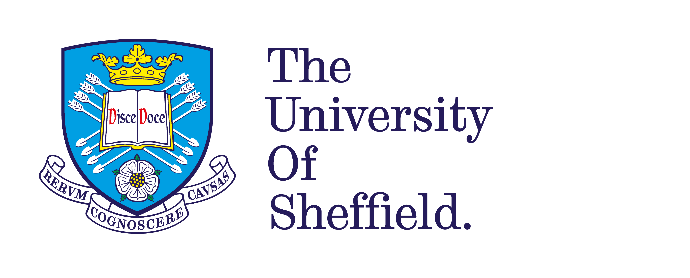

# LunchBytes
## _Python Virtual Environment Showdown_

15th Sep 2021

University of Sheffield RSE Team

{ height=150px }
{ height=150px }
{ height=150px }

# Today

3 x ~10min talks followed by Q&A

Speakers:

::: incremental

* Matt Williams, Univeristy of Bristol - `venv`
* Simon Li, Univeristy of Dundee - `conda`
* James Graham, Software Sustainability Institute - `poetry`

:::

# Q&A

Questions via: <https://app.sli.do/event/hcmaidrc>

We'll revisit questions after all of the talks.

#  Background

::: incremental
* `python` is an extremely popular language in research
* imports libraries, modules, packages for additional functionality
* `pip` is a bundled program which installs packages
* `python` normally looks for imports system-wide
:::

# What's the issue?
::: incremental
* Required package versions may conflict between projects
* Dependency management
* Python version management
* Reproducibility & reliability
:::

# Talks

# Q&A

# Future Events

* SeptembRSE!
    * Online research software engineering conference
    * Registration open throughout
    * Talks, discussions, panels, demos until 30th Sep
    * <https://septembrse.society-rse.org/>
    * Only £15 for members of the Society of Research Software Engineering

# Future Events

* LunchBytes: 13th October
    * _Better MATLAB, Better Research_
    * Speakers from Sheffield & MathWorks
    * <https://rse.shef.ac.uk/events/lunchbytes-2021-10-13.html>
    * <https://bit.ly/lunchbytesOct21>

# Future Events

* Further notifications
    * Mailing list: [rse.shef.ac.uk/community/](https://rse.shef.ac.uk/community/)
    * Follow us on twitter: [\@RSE_Sheffield](https://twitter.com/RSE_Sheffield)
    * Our website: [rse.shef.ac.uk](https://rse.shef.ac.uk/)

# Getting involved with LunchBytes

We're looking for:

* Session curators,
* Speakers,
* Theme suggestions

Details at: [rse.shef.ac.uk/community/lunch-bytes/](https://rse.shef.ac.uk/community/lunch-bytes/)

Or email: <lunchbytes-organisers-group@sheffield.ac.uk>

# Thank you!
